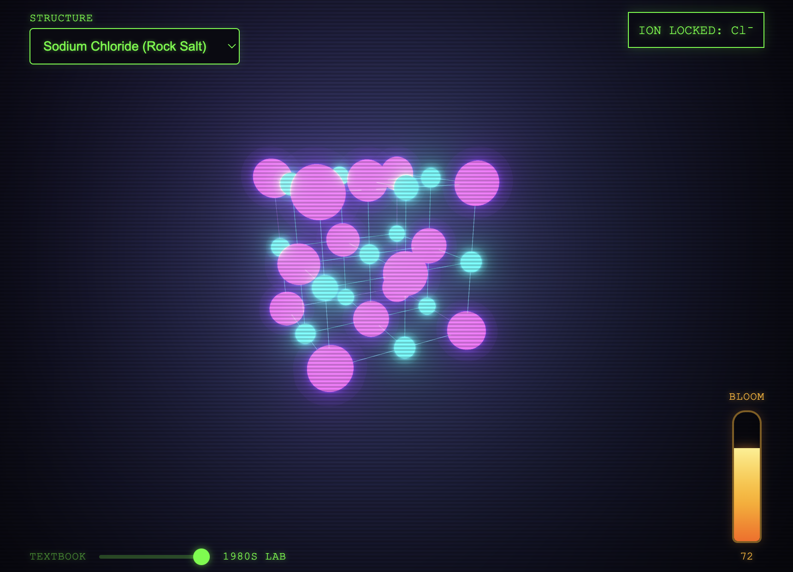
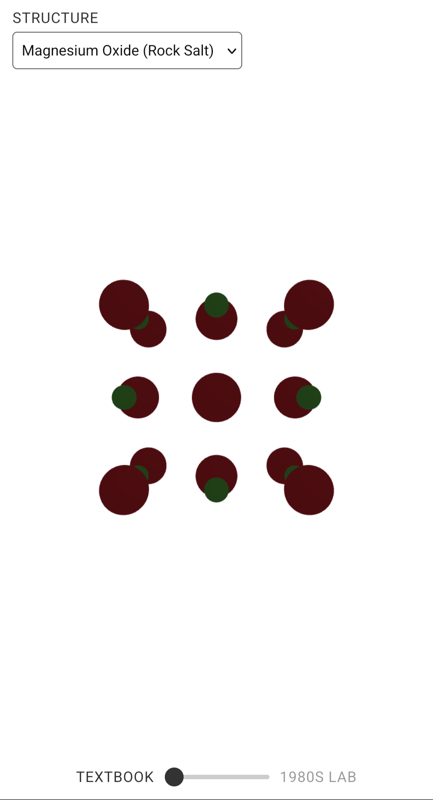

# simple lattice structures visualizer

Interactive 3D crystal lattice viewer for Cu (FCC), NaCl (rocksalt), and MgO (rocksalt) unit cells.

**Desktop Controls**

- Top left — pick a structure
- Drag to rotate, scroll to zoom
- Click an ion to identify it
- Bottom left — switch display style

## Deployment

[Live demo](https://fcc-visualizer.vercel.app/)

## Features

Raycast picking, hand-built line BufferGeometry, HDR-emissive + bloom with tone-mapping disabled, data-driven theming

## Desktop Screenshot



## Mobile Screenshot



## Scripts

```bash
npm run dev      # http://localhost:3000
npm run build
npm run preview
```

Runs in CodeSandbox / Codespaces via `.codesandbox/tasks.json` and `.devcontainer/devcontainer.json`.
